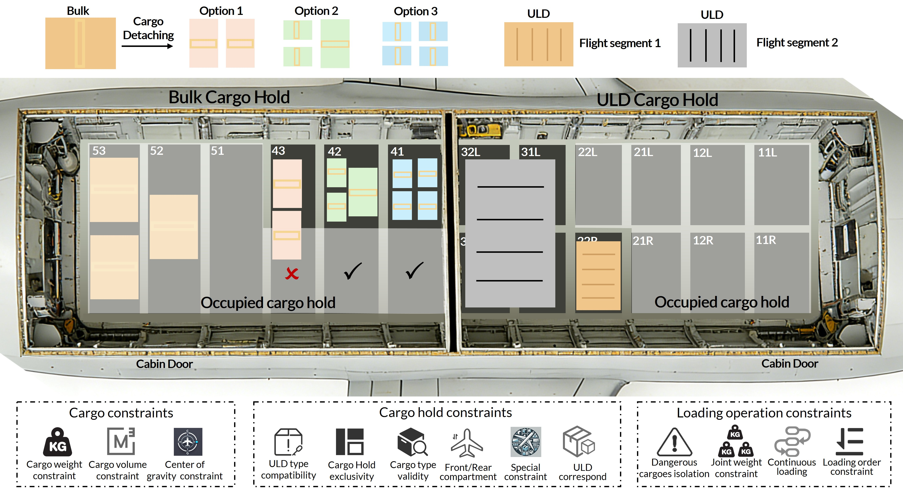
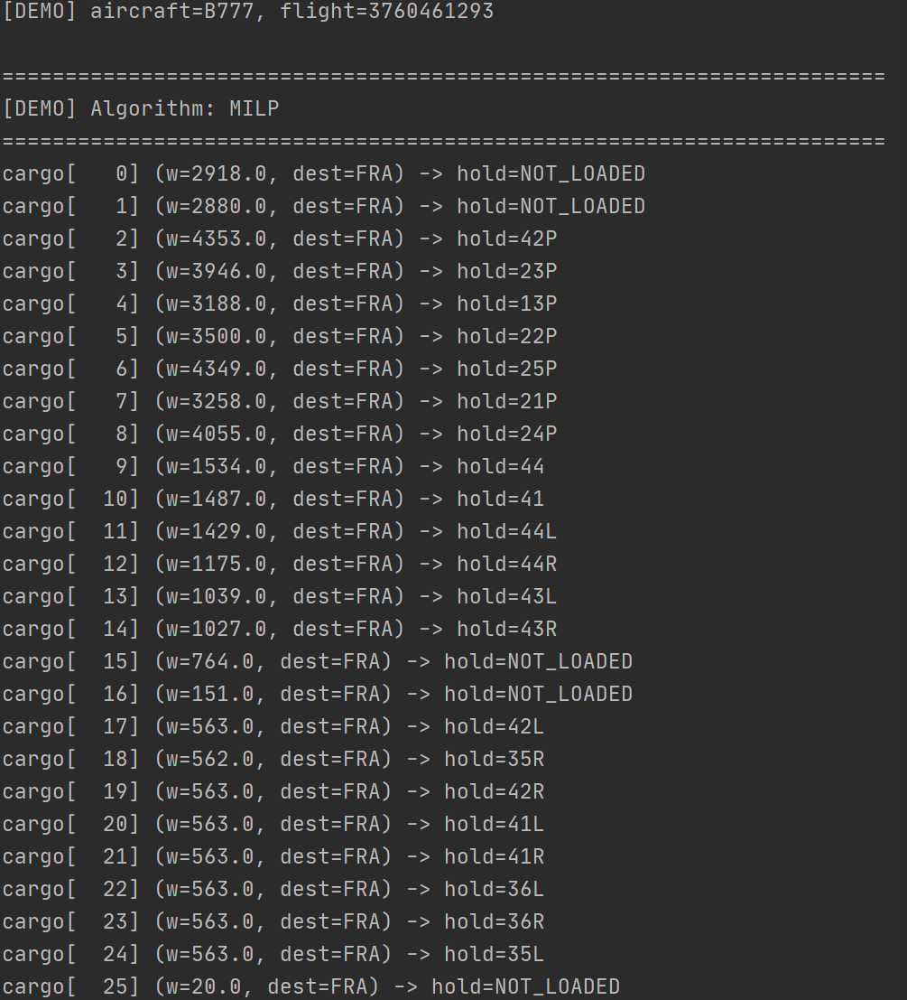

<a href="https://linc-bit.github.io/AirCa/html-page/index.html">

</a>


<div align="center">
<a href="https://linc-bit.github.io/AirCa/html-page/index.html#quickstart" style="text-decoration:none; outline:none;">
    
</a>
  &nbsp;&nbsp;&nbsp;&nbsp;
<a href="https://github.com/LINC-BIT/AirCa/tree/main/code" style="text-decoration:none; outline:none;">
    
</a>
</div>


<div align="center">

📌 [Demo](https://linc-bit.github.io/AirCa/html-page/index.html#examples) &nbsp;&nbsp;|&nbsp;&nbsp; 📖 [Overview](https://linc-bit.github.io/AirCa/html-page/index.html#about) &nbsp;&nbsp;|&nbsp;&nbsp; 🤗 [Download](https://huggingface.co/datasets/LINC-BIT/AirCa)

</div>


# AirCa Demo
Users can select from 5 preset loading inistances, choose an optimization algorithm, and generate a loading plan with one click. Results are visualized directly on a 3D aircraft hold layout (Gif below).


<div align="center">
 


</div>

Click here to access AirCa demo: https://linc-bit.github.io/AirCa/html-page/index.html#examples


# Tutorial index

- [1. AirCa](#1-airca)
- [2. Download](#2-download)
- [3. Description](#3-description)
  * [3.1 AirCa data field](#31-airca-data-field)
  * [3.2 Constraints description](#32-constraints-description)
- [4. Tutorials of workloads](#4-tutorials-of-workloads)
  * [4.1 Multi-constraint cargo loading](#41-multi-constraint-cargo-loading)
  * [4.2 Cargo loading with massive variables](#42-cargo-loading-with-massive-variables)
  * [4.3 Multi-segment cargo loading](#43-multi-segment-cargo-loading)
- [5. The AirCa APIs](#5-the-airca-apis)

- [6. References](#6-references)


Dataset Download: https://huggingface.co/datasets/LINC-BIT/AirCa       
Dataset Website: https://linc-bit.github.io/AirCa/html-page/index.html   
Code Link: https://github.com/LINC-BIT/AirCa     
Paper Link:  


# 1. AirCa

 **AirCa** is a publicly available  aircraft cargo loading dataset with  millions of instances from industry. It has three unique characteristics: 
(1) Large-scale, AirCa contains in total 6,071k records and 1,092k flights, covering 6 aircraft types and 425 airports over a total span of 9 months. 
(2) Comprehensive information, AirCa is delivered to provide rich information pertaining to aircraft cargo loading, including detailed cargo characteristic information, loading-event logs, flight destination, and comprehensive loading constraints in practical scenarios.
(3) Diversity,  AirCa aims to increase data diversity from three perspectives: destination diversity, Flight diversity, and Constraint diversity.



This figure illustrates an air cargo loading scenario comprising three parts: (1) *Air cargo* has two types: bulk cargo, which consists of individual sub-cargoes, and Unit Load Devices (ULDs), which are pre-packed standardized containers. (2) *Cargo holds* accommodate bulk cargoes (e.g., narrow-body aircraft such as the A320) and ULDs (e.g., wide-body aircraft such as the B777). Notably, when loaded into bulk cargo holds, different cargo detaching granularities produce a massive number of loading options.
(3) *Constraints* determine the feasibility of loading operations, including cargo constraints, cargo hold constraints, and loading operation constraints. In this figure's example, the flight has two destinations, and hence the ULDs are categorized into two segments. Such multi-segment cargo loading further complicates the combinatorial optimization problem.

# 2. Download

AirCa can be used for research purposes. Before you download the dataset, please read these terms.
Then put the data into "./data/raw/".  
The structure of "./data/raw/" should be like:  
```
* ./data/raw/  
    * split_by_aircraft_type    
        * A320.csv   
        * ...    
    * split_by_date  
        * BAKFLGITH_LOADDATA2024-10-12.csv  
        * ...
```
```python
import pandas as pd
>>> import pandas as pd
>>> df = pd.read_csv("BAKFLGITH_LOADDATA2024-10-12.csv")
>>> df.head(3)
       FLIGHT  TYPE DEST  WEIGHT  ... CONT PRIORITY VOLUME  SPECIAL CARGO
0  3744617311  A320  SIN     177  ...  NaN        1    0.0            NaN
1  3744617311  A320  SIN     177  ...  NaN        1    0.0            NaN
2  3744617332  A320  SIN     560  ...  NaN        1    0.0            NaN
```

# 3. Description
## 3.1 AirCa data field
| Data field | Description | Unit/format |
|---|---|---|
| **Cargo information** |  |  |
| Loading order | Record of the cargo loading order | String |
| ID | Unique identifier for cargo | ID |
| Weight | Weight of cargo | String |
| ULD type | Types of cargo including ULD and bulk cargo | String |
| Priority | Cargo loading priority | String |
| Length | Length of cargo | Float |
| Width | Width of cargo | Float |
| Height | Height of cargo | Float |
| Detaching information | The record of detached cargoes | String |
| **Flight information** |  |  |
| Loading time | Record of the cargo loading time | Time |
| Flight ID (anonymity) | Record of the different flights | ID |
| Destination airport | Record of the airport's name | String |
| Segment | The record of whether it is a multi-segment flight | Bool |
| **Aircraft information** |  |  |
| Aircraft type | The type of the aircraft | String |
| Constraints | The constraints of air cargo loading | Constraint format |


## 3.2 Constraints description
| Constraint | Description |
|---|---|
| **Cargo constraints** |  |
| Cargo weight constraint | Maximum weight limit per cargo hold |
| Cargo volume constraint | Maximum volume limit per cargo hold |
| Center of gravity constraint | Forward and backward CG limits |
| **Cargo hold constraints** |  |
| ULD type compatibility | ULD type must match cargo hold specification |
| Cargo hold exclusivity | Each cargo hold accommodates at most one ULD |
| Cargo type validity | Cargo type must be valid for the cargo hold |
| Front/Rear compartment | Short-haul cargo is prioritized for loading in rear cargo hold |
| Special constraint | Certain holds prohibit specific dangerous cargoes |
| ULD correspond constraint | Each cargo hold accepts only compatible ULD types |
| **Loading operation constraints** |  |
| Dangerous cargoes isolation | Minimum distance between incompatible dangerous cargoes |
| Joint weight constraint | Maximum weight limit for adjacent cargo hold combinations |
| Continuous loading | No gaps between cargoes during loading process |
| Loading order constraint | Short-haul cargo positioned outboard of long-haul cargo |

# 4. Tutorials of workloads
We extract three representative workloads from AirCa including multi-constraint cargo loading, cargo loading 
with massive variables, and multi-segment cargo loading. 

| Workload name | Workload characteristic | Challenge |
|---|---|---|
| Multi-constraint cargo loading | High modeling complexity arises from intertwined constraints and heterogeneous cargo/ULD data that require distinct variable sets. | Oversimplified modeling can reduce solution accuracy when algorithms face complex constraint interactions. |
| Cargo loading with massive variables | Cargo detaching at finer granularities dramatically increases decision variables and expands the search space exponentially. | Massive variables slow heuristic optimization because far more candidate solutions must be explored as the search space grows. |
| Multi-segment cargo loading | Multi-stage sequential decisions with dual objectives (minimizing CG offset while maximizing profit) increase problem complexity. | Conflicting objectives require re-balancing across stages, which can increase computation time to achieve feasible and high-quality solutions. |

Before running the workloads, please install the required Python libraries and preprocess the data from the huggingface:

```bash
pip install -r requirements.txt

python data_preprocess.py --input-path /data/raw/ --output-path /data/processed/
```


## 4.1 Multi-constraint cargo loading

This workload evaluates air cargo loading algorithms under **incrementally modeling complexity sets**.  
It supports **A320 (narrow-body, bulk hold)** and **B777 (wide-body, ULD hold)**, and reports performance across multiple constraint levels.

### Experiment 1: Constraint incremental analysis

#### Prerequisites
Prepare the following paths:
- **code root path**: a directory that contains `algorithm/` and `multi_constraint_cargo_loading/`
- **aircraft path**: aircraft configuration files (default: `G:\AirCa\code\aircraft_data`)
- **cargo path**: flight cargo CSV files
- **output path**: where results will be saved

> Tip: run the script from `multi_constraint_cargo_loading/` to avoid import issues.

#### Key arguments
- `--mode`: `both` (A320 + B777), `narrowbody` (A320 only), `widebody` (B777 only)
- `--aircraft`: aircraft type list for narrow-body mode (e.g., `A320`)
- `--n-flights`: number of flights sampled per aircraft
- `--time-limit`: per-algorithm time limit (seconds)
- `--code-path`, `--benchmark-path`, `--cargo-data-path`, `--output-path`: paths for reproducibility

#### Run
**Recommended (run both A320 and B777 with defaults):**
```bash
cd <code root path>\multi_constraint_cargo_loading
python Constraint_incremental_analysis.py --mode both

# A320 only
python Constraint_incremental_analysis.py --mode narrowbody --aircraft A320 --n-flights 10

# B777 only
python Constraint_incremental_analysis.py --mode widebody --n-flights 50

# Full template
python Constraint_incremental_analysis.py ^
  --code-path <code root path> ^
  --benchmark-path <aircraft path> ^
  --cargo-data-path <cargo path> ^
  --output-path <output path> ^
  --mode both ^
  --n-flights 10 ^
  --time-limit 30
```


### Experiment 2: Aircraft configuration comparison (A320 / B777 / C919)

This experiment compares three representative aircraft types—**A320**, **B777**, and **C919**—under the same algorithm set.  
For each aircraft, it reports the **CG gap** and **computation time** achieved by each algorithm, highlighting how aircraft configurations affect optimization difficulty.

#### What you need to prepare
- **code root**: the project root that contains the `algorithm/` package
- **cargo path**: a folder containing `BAKFLGITH_LOADDATA*.csv`
- **aircraft path**: aircraft configuration data folder (contains subfolders like `A320/`, `B777/`, `C919/`)
- **output path**: where results will be saved

#### Key settings
- `--aircraft all`: run A320 + B777 + C919 in one run  
- `--mode single`: batch evaluation on *single-segment* flights  
- `--n-flights`: number of flights sampled per aircraft  
- `--time-limit`: per-algorithm time limit (seconds, optional)  
- `--algos`: comma-separated algorithm names (e.g., `MILP,GA,PSO`), or `all`

#### Run
```bash
python "aircraft configuration comparison script" --code-root "code root" --cargo-data-dir "cargo path" --aircraft-data-dir "aircraft path" --output-dir "output path" --aircraft all --mode single --n-flights 100 --time-limit 30 --algos all
```


## 4.2 Cargo loading with massive variables


### Experiment 3: Variable scaling analysis (A320)

This experiment studies scalability by detaching bulk cargo into progressively finer granularities (100/50/25/10 kg), which increases the number of decision variables from tens to thousands per flight. For each scale, it records computation time (and CG gap) of multiple combinatorial optimization algorithms to reveal their scaling behavior. :contentReference[oaicite:0]{index=0}

#### What you need to prepare
- **code root**: a directory that contains the `algorithm/` folder (the script imports `algorithm.for_narrow.*`).
- **aircraft path**: aircraft configuration files (default: `G:\AirCa\code\aircraft_data`) and it must include `A320.csv` (the 2nd column is used as `hold_id`) plus optional CG limit files `stdZfw_a.csv/stdZfw_f.csv`. :contentReference[oaicite:2]{index=2}  
- **cargo path**: directory containing `BAKFLGITH_LOADDATA*.csv`. :contentReference[oaicite:3]{index=3}  
- **output path**: where result CSV files will be saved. :contentReference[oaicite:4]{index=4}  

#### Key settings
- `--split-thresholds`: cargo detaching thresholds in kg (default: `100,50,25,10`)  
- `--n-flights`: number of top single-segment flights tested (default: `4`)  
- `--time-limit`: time limit passed to each algorithm (default: `120` seconds)  
- `--algo-timeout`: hard timeout per algorithm run (default: `120` seconds)  
- `--constraint-level`: `basic` or `tight` (if `tight`, CG envelope violations are also checked and reported)  
- `--no-exclusive-check`: disable exclusive-hold violation checking (optional)  
- `--algorithms`: optionally run a subset of algorithms by class name (comma-separated) :contentReference[oaicite:5]{index=5}

#### Run
```bash
python "code_root/AirCa/code/cargo_loading_with_massive_variables/Variable_scaling_analysis.py" --code-root "code root" --aircraft-data-dir "aircraft path" --cargo-data-dir "cargo path" --output-dir "output path" --n-flights 4 --time-limit 120 --algo-timeout 120 --split-thresholds 100,50,25,10 --constraint-level basic
```

### Experiment 4: Timeout behavior characterization (A320)

This experiment evaluates how solution quality changes under strict time budgets by imposing time limits of **10s, 30s, 60s, and 120s**. It measures the **CG gap at termination** for each algorithm, distinguishing methods that converge quickly from those that need longer computation.

#### What you need to prepare
- **code root**: a directory that contains the `algorithm/` folder (the script imports `algorithm.for_narrow.*`).
- **aircraft path**: aircraft configuration files (must include `A320.csv`; the 2nd column is used as `hold_id`, and optional CG limit files may be used).
- **cargo path**: directory containing `BAKFLGITH_LOADDATA*.csv`.
- **output path**: where result CSV files will be saved.

#### Key settings
- `--time-limits`: time limits (seconds) swept in this experiment (use `10,30,60,120`).
- `--split-threshold`: cargo detaching threshold in kg used to fix the variable scale (e.g., `50`).
- `--n-flights`: number of top single-segment flights tested.
- `--extra-timeout-buffer`: extra seconds added to avoid hard cutoff (recommended).
- `--algorithms`: optionally run a subset of algorithms by class name (comma-separated); otherwise run all.

#### Run
```bash
python "code_root/AirCa/code/cargo_loading_with_massive_variables/Timeout_behavior_characterization.py" --code-root "code root" --aircraft-data-dir "aircraft path" --cargo-data-dir "cargo path" --output-dir "output path" --n-flights 4 --split-threshold 50 --time-limits 10,30,60,120 --extra-timeout-buffer 30
```


## 4.3 Multi-segment cargo loading


### Experiment 5: Multi-stage trade-off analysis (A320 & B777)

This experiment evaluates multi-stage cargo loading under two objective modes: **CG-priority** (minimize CG deviation) and **profit-priority** (maximize transportation profit while satisfying CG envelope feasibility). Both modes use the same multi-stage sequential constraint (long-haul cargo is loaded first into inner holds), and we report the achieved **CG gap** and **profit** on **A320** and **B777**.

#### What you need to prepare
- **code root**: a directory that contains the `algorithm/` folder (the script loads narrow-body and wide-body algorithms from different modules).
- **aircraft path**: aircraft configuration data (must include subfolders/files for `A320` and `B777`).
- **cargo path**: directory containing `BAKFLGITH_LOADDATA*.csv`.
- **output path**: where result CSV files will be saved.

#### Key settings
- `--aircraft A320 B777`: run both aircraft types (recommended).
- `--n-flights`: number of flights sampled per aircraft.
- `--time-limit`: per-algorithm time limit (seconds).
- Objective modes are evaluated automatically:
  - **CG-priority**: strictly minimizes CG gap.
  - **profit-priority**: maximizes profit with CG envelope as feasibility.

#### Run
```bash
python "multi-stage trade-off script" --code-root "code root" --benchmark-path "aircraft path" --cargo-data-path "cargo path" --output-path "output path" --aircraft A320 B777 --n-flights 10 --time-limit 15
```


### Experiment 6: Single-stage versus multi-stage comparison (A320 & B777)

This experiment evaluates **150 multi-segment flights** using both **single-stage** and **multi-stage** optimization. It compares **CG gap**, **transportation profit**, and **computation time** on these multi-segment instances to quantify the benefits of multi-stage optimization.

#### What you need to prepare
- **code root**: a directory that contains the `algorithm/` folder (narrow-body and wide-body algorithms are loaded from different modules).
- **aircraft path**: aircraft configuration data (must include `A320` and `B777` configurations).
- **cargo path**: directory containing `BAKFLGITH_LOADDATA*.csv`.
- **output path**: where result CSV files will be saved.

#### Key settings
- `--aircraft A320 B777`: run both aircraft types (recommended).
- `--n-pairs`: number of multi-segment flight instances sampled for the comparison (set to `150` for this experiment).
- `--time-limit`: per-algorithm time limit (seconds).

#### Run
```bash
python "single-vs-multi-stage comparison script" --code-root "code root" --benchmark-path "aircraft path" --cargo-data-path "cargo path" --output-path "output path" --aircraft A320 B777 --n-pairs 150 --time-limit 15
```

## 4.4 Running example
```
python "<code root path>/AirCa/code/multi_constraint_cargo_loading/Aircraft_configuration_comparison..py" --code-root "code root" --cargo-data-dir "cargo path" --aircraft-data-dir "aircraft path" --output-dir "output path" --aircraft B777 --mode demo --flight-number "flight number" --algos all --time-limit 120

```




# 5. The AirCa APIs
In addition to our AirCa dataset, we release the AirCa package,
including three types of APIs. It is designed to faciliate researchers
in developing aircraft cargo loading applications.The details are
presented as follows:

**DataDownloader**. This API allows researchers to download the
AirCa data. the code presents how to utilize the DataDownloader
API to download the up-to-date AirCa data.
DataDownloader. This API allows researchers to download the
AirCa data. Figure 4 presents how to utilize the DataDownloader
API to download the up-to-date AirCa data.
```python
from api . download_airca import AirCaDownloader
downloader = AirCaDownloader ()
# Download data A320
downloader . download_AirCa ( url , path , aircraft_type =" A320 " ,
date =" 2024 -10 -12 ")
# Download data B737
downloader . download_AirCa ( url , path , aircraft_type =" B737 " ,
date = None )
# Download data for all available aircraft types
downloader . download_AirCa ( url , path , aircraft_type = None ,
date = None )
```
  
**DataRetriever**. This API enables researchers to conveniently
obtain the AirCa data stroed in the local machine. For instance,
the code shows how to employ the DataRetriever API to obtain the
AirCa data for aircraft type B777.
```python
from api . retriever import Retriever
retriever = Retriever ()
# Enter the type A320
retriever . retrieve ( path = path , aircraft_type = " A320 ")
# Enter the type B777
retriever . retrieve ( path = path , aircraft_type = " B777 ")
# Enter the type B787
retriever . retrieve ( path = path , aircraft_type = " B787 ")
```

**DataLoader**. This API is designed to assist researchers in their
applications of aircraft cargo loading. It allows researchers to flex-
ibly and seamlessly merge multiple modalities of AirCa data. It
exposes the AirCa through a DataLoader object after performing necessary data preprocessing techniques. A PyTorch example of
using our DataLoader API for training DNNs is shown in the code.
```python
import torch
from torch . utils . data import DataLoader
# generate AirCa ( A320 ) dataset for training
dataloader1 = DataLoader ( AircraftDataset ( path ," A320 ") ,
batch_size = batch_size , shuffle = True )
# generate AirCa ( B777 ) dataset for training
dataloader2 = DataLoader ( AircraftDataset ( path ," B777 ") ,
batch_size = batch_size , shuffle = True )
# generate AirCa ( B787 ) dataset for training
dataloader3 = DataLoader ( AircraftDataset ( path ," B787 ") ,
batch_size = batch_size , shuffle = True )
train_model ( dataloader1 , baseline_name , criterion ,
optimizer , epochs =600)
```

# 6. References
[1] Zhao, X., Dong, Y., & Zuo, L. (2023). A combinatorial optimization approach for air cargo palletization and aircraft loading. *Mathematics, 11*(13), 2798.  
[2] Mesquita, A. C. P., & Sanches, C. A. A. (2024). Air cargo load and route planning in pickup and delivery operations. *Expert Systems with Applications, 249*, 123711.  
[3] Yan, S., Lo, C.-T., & Shih, Y.-L. (2006). Cargo container loading plan model and solution method for international air express carriers. *Transportation Planning and Technology, 29*(6), 445–470.  
[4] Yan, S., Shih, Y.-L., & Shiao, F.-Y. (2008). Optimal cargo container loading plans under stochastic demands for air express carriers. *Transportation Research Part E: Logistics and Transportation Review, 44*(3), 555–575.  
[5] Limbourg, S., Schyns, M., & Laporte, G. (2012). Automatic aircraft cargo load planning. *Journal of the Operational Research Society, 63*(9), 1271–1283.  
[6] Zhao, X., Yuan, Y., Dong, Y., & Zhao, R. (2021). Optimization approach to the aircraft weight and balance problem with the centre of gravity envelope constraints. *IET Intelligent Transport Systems, 15*(10), 1269–1286.  
[7] Lurkin, V., & Schyns, M. (2015). The airline container loading problem with pickup and delivery. *European Journal of Operational Research, 244*(3), 955–965.  
[8] Zhu, L., Wu, Y., Smith, H., & Luo, J. (2023). Optimisation of containerised air cargo forwarding plans considering a hub consolidation process with cargo loading. *Journal of the Operational Research Society, 74*(3), 777–796.  
[9] Chenguang, Y., Liu, H., & Yuan, G. (2018). Load planning of transport aircraft based on hybrid genetic algorithm. In *MATEC’18, Vol. 179* (pp. 01007). EDP Sciences.  
[10] Dahmani, N., & Krichen, S. (2016). Solving a load balancing problem with a multi-objective particle swarm optimisation approach: application to aircraft cargo transportation. *International Journal of Operational Research, 27*(1-2), 62–84.  
[11] Dahmani, N., & Krichen, S. (2013). On solving the bi-objective aircraft cargo loading problem. In *ICMSAO’13* (pp. 1–6). IEEE.  
[12] Gajda, M., Trivella, A., Mansini, R., & Pisinger, D. (2022). An optimization approach for a complex real-life container loading problem. *Omega, 107*, 102559.  


<!-- If you find this helpful, please cite our paper:

```shell
@misc{wu2023lade,
      title={LaDe: The First Comprehensive Last-mile Delivery Dataset from Industry}, 
      author={Lixia Wu and Haomin Wen and Haoyuan Hu and Xiaowei Mao and Yutong Xia and Ergang Shan and Jianbin Zhen and Junhong Lou and Yuxuan Liang and Liuqing Yang and Roger Zimmermann and Youfang Lin and Huaiyu Wan},
      year={2023},
      eprint={2306.10675},
      archivePrefix={arXiv},
      primaryClass={cs.DB}
}
``` -->
