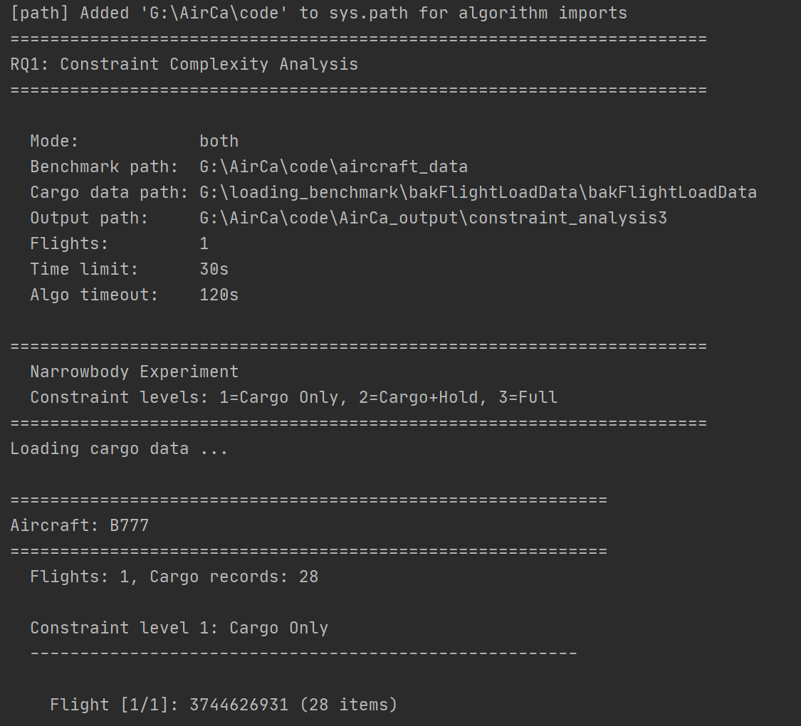
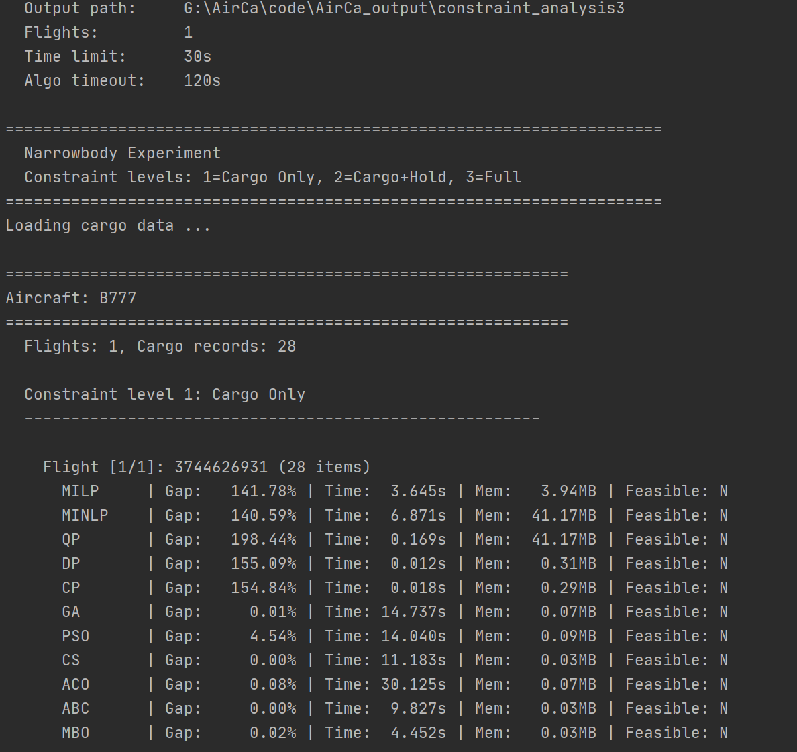

<a href="https://linc-bit.github.io/AirCa/html-page/index.html">

</a>


<div align="center">
<a href="https://linc-bit.github.io/AirCa/html-page/index.html#quickstart" style="text-decoration:none; outline:none;">
    
</a>
  &nbsp;&nbsp;&nbsp;&nbsp;
<a href="https://github.com/LINC-BIT/AirCa/tree/main/code" style="text-decoration:none; outline:none;">
    
</a>
</div>


<div align="center">

📌 [Demo](https://linc-bit.github.io/AirCa/html-page/index.html#examples) &nbsp;&nbsp;|&nbsp;&nbsp; 📖 [Overview](https://linc-bit.github.io/AirCa/html-page/index.html#about) &nbsp;&nbsp;|&nbsp;&nbsp; 🤗 [Download](https://huggingface.co/datasets/LINC-BIT/AirCa)

</div>


# AirCa Demo
Users can select from 6 preset experiments, choose an optimization algorithm, and generate a loading plan with one click. Results are visualized directly on a 3D aircraft hold layout (Gif below).


<div align="center">
 


</div>

Click here to access AirCa demo: https://linc-bit.github.io/AirCa/html-page/index.html#examples


# Tutorial index

- [AirCa Demo](#airca-demo)
- [Tutorial index](#tutorial-index)
- [1. AirCa](#1-airca)
- [2. Download](#2-download)
- [3. Description](#3-description)
  - [3.1 AirCa data field](#31-airca-data-field)
  - [3.2 Constraints description](#32-constraints-description)
- [4. Tutorials of workloads](#4-tutorials-of-workloads)
    - [Evaluation metrics](#evaluation-metrics)
    - [Common modeling notes](#common-modeling-notes)
  - [4.1 Constraint incremental analysis](#41-constraint-incremental-analysis)
  - [4.2 Aircraft configuration comparison](#42-aircraft-configuration-comparison)
  - [4.3 Variable scaling analysis](#43-variable-scaling-analysis)
  - [4.4 Timeout behavior characterization](#44-timeout-behavior-characterization)
  - [4.5 Multi-stage trade-off analysis](#45-multi-stage-trade-off-analysis)
  - [4.6 Single-stage versus multi-stage comparison](#46-single-stage-versus-multi-stage-comparison)
- [5. The AirCa APIs](#5-the-airca-apis)
- [6. References](#6-references)


Dataset Download: https://huggingface.co/datasets/LINC-BIT/AirCa       
Dataset Website: https://linc-bit.github.io/AirCa/html-page/index.html   
Code Link: https://github.com/LINC-BIT/AirCa     
Paper Link:  


# 1. AirCa

 **AirCa** is a publicly available  aircraft cargo loading dataset with  millions of instances from industry. It has three unique characteristics: 
(1) Large-scale, AirCa contains in total 6,071k records and 1,092k flights, covering 6 aircraft types and 425 airports over a total span of 9 months. 
(2) Comprehensive information, AirCa is delivered to provide rich information pertaining to aircraft cargo loading, including detailed cargo characteristic information, loading-event logs, flight destination, and comprehensive loading constraints in practical scenarios.
(3) Diversity,  AirCa aims to increase data diversity from three perspectives: destination diversity, Flight diversity, and Constraint diversity.


This figure illustrates an air cargo loading scenario comprising three parts: (1) *Air cargo* has two types: bulk cargo, which consists of individual sub-cargoes, and Unit Load Devices (ULDs), which are pre-packed standardized containers. (2) *Cargo holds* accommodate bulk cargoes (e.g., narrow-body aircraft such as the A320) and ULDs (e.g., wide-body aircraft such as the B777). Notably, when loaded into bulk cargo holds, different cargo detaching granularities produce a massive number of loading options.
(3) *Constraints* determine the feasibility of loading operations, including cargo constraints, cargo hold constraints, and loading operation constraints. In this figure's example, the flight has two destinations, and hence the ULDs are categorized into two segments. Such multi-segment cargo loading further complicates the combinatorial optimization problem.

# 2. Download

AirCa can be used for research purposes. Before you download the dataset, please read these terms.
Then put the data into "./data/raw/".  
The structure of "./data/raw/" should be like:  
```
* ./data/raw/  
    * split_by_aircraft_type    
        * A320.csv   
        * ...    
    * split_by_date  
        * BAKFLGITH_LOADDATA2024-10-12.csv  
        * ...
```
```python
import pandas as pd
>>> import pandas as pd
>>> df = pd.read_csv("BAKFLGITH_LOADDATA2024-10-12.csv")
>>> df.head(3)
       FLIGHT  TYPE DEST  WEIGHT  ... CONT PRIORITY VOLUME  SPECIAL CARGO
0  3744617311  A320  SIN     177  ...  NaN        1    0.0            NaN
1  3744617311  A320  SIN     177  ...  NaN        1    0.0            NaN
2  3744617332  A320  SIN     560  ...  NaN        1    0.0            NaN
```

# 3. Description
## 3.1 AirCa data field
| Data field | Description | Unit/format |
|---|---|---|
| **Cargo information** |  |  |
| Loading order | Record of the cargo loading order | String |
| ID | Unique identifier for cargo | ID |
| Weight | Weight of cargo | String |
| ULD type | Types of cargo including ULD and bulk cargo | String |
| Priority | Cargo loading priority | String |
| Length | Length of cargo | Float |
| Width | Width of cargo | Float |
| Height | Height of cargo | Float |
| Detaching information | The record of detached cargoes | String |
| **Flight information** |  |  |
| Loading time | Record of the cargo loading time | Time |
| Flight ID (anonymity) | Record of the different flights | ID |
| Destination airport | Record of the airport's name | String |
| Segment | The record of whether it is a multi-segment flight | Bool |
| **Aircraft information** |  |  |
| Aircraft type | The type of the aircraft | String |
| Constraints | The constraints of air cargo loading | Constraint format |


## 3.2 Constraints description
| Constraint | Description |
|---|---|
| **Cargo constraints** |  |
| Cargo weight constraint | Maximum weight limit per cargo hold |
| Cargo volume constraint | Maximum volume limit per cargo hold |
| Center of gravity constraint | Forward and backward CG limits |
| **Cargo hold constraints** |  |
| ULD type compatibility | ULD type must match cargo hold specification |
| Cargo hold exclusivity | Each cargo hold accommodates at most one ULD |
| Cargo type validity | Cargo type must be valid for the cargo hold |
| Front/Rear compartment | Short-haul cargo is prioritized for loading in rear cargo hold |
| Special constraint | Certain holds prohibit specific dangerous cargoes |
| ULD correspond constraint | Each cargo hold accepts only compatible ULD types |
| **Loading operation constraints** |  |
| Dangerous cargoes isolation | Minimum distance between incompatible dangerous cargoes |
| Joint weight constraint | Maximum weight limit for adjacent cargo hold combinations |
| Continuous loading | No gaps between cargoes during loading process |
| Loading order constraint | Short-haul cargo positioned outboard of long-haul cargo |

# 4. Tutorials of workloads
We extract three representative workloads from AirCa including multi-constraint cargo loading, cargo loading 
with massive variables, and multi-segment cargo loading. 

| Workload name | Workload characteristic | Challenge |
|---|---|---|
| Multi-constraint cargo loading | High modeling complexity arises from intertwined constraints and heterogeneous cargo/ULD data that require distinct variable sets. | Oversimplified modeling can reduce solution accuracy when algorithms face complex constraint interactions. |
| Cargo loading with massive variables | Cargo detaching at finer granularities dramatically increases decision variables and expands the search space exponentially. | Massive variables slow heuristic optimization because far more candidate solutions must be explored as the search space grows. |
| Multi-segment cargo loading | Multi-stage sequential decisions with dual objectives (minimizing CG offset while maximizing profit) increase problem complexity. | Conflicting objectives require re-balancing across stages, which can increase computation time to achieve feasible and high-quality solutions. |

Before running the workloads, please install the required Python libraries and preprocess the data from the huggingface:

```bash
pip install -r requirements.txt

python data_preprocess.py --input-path /data/raw/ --output-path /data/processed/
```

### Evaluation metrics
The experimental results in Section 4 mainly report CG-related gap, and algorithm runtime.

**CG (center of gravity):** In the weight-and-balance setting, the aircraft CG is represented by the balance arm, denoted by $BA$, which is the horizontal distance from the reference datum to the location of the aircraft center of gravity. In the index-based formulation used by practice, the CG position is related to the aircraft by

$$
CG = \frac{W \cdot (BA - RA)}{C} + K,
$$
where $W$ is the actual aircraft weight, $BA$ is the horizontal distance from the reference datum to the CG location, $RA$ is the reference arm, $C$ is the aircraft weight constant, and $K$ is a constant introduced to avoid negative index values.

**CG gap:** The CG gap is computed as the absolute deviation normalized by the optimal value:
$$
\text{Gap}(\%) = \frac{|CG_{actual} - CG_{opt}|}{|CG_{opt}|} \times 100
$$


**Algorithm runtime:** Algorithm runtime refers to the wall-clock execution time of each baseline from the start of optimization to termination under the prescribed time limit.


### Common modeling notes
All workloads use an assignment-based cargo loading model. Let $I$ be the set of cargo items and $H$ be the set of cargo holds. The binary variable is

$$
x_{ih} =
\begin{cases}
1, & \text{if cargo item } i \text{ is assigned to hold } h, \\
0, & \text{otherwise}.
\end{cases}
$$

The total loaded weight and longitudinal CG surrogate are computed as

$$
W = W_0 + \sum_{i \in I}\sum_{h \in H} w_i x_{ih},
\qquad
CG = CG_0 + \sum_{i \in I}\sum_{h \in H} w_i a_h x_{ih},
$$

where $W_0$ and $CG_0$ are the aircraft initial zero-fuel quantities, $w_i$ is the cargo weight, and $a_h$ is the hold CG coefficient. The target CG is interpolated from the aircraft CG envelope:

$$
CG^\star(W) = CG^{aft}(W) + \frac{CG^{fwd}(W) - CG^{aft}(W)}{3}.
$$

For single-segment experiments, the common objective is

$$
\min \; |CG - CG^\star(W)|.
$$

The main constraints are

$$
\sum_{h \in H} x_{ih} \le 1, \qquad \forall i \in I,
$$

$$
\sum_{i \in I} w_i x_{ih} \le \bar W_h, \qquad \forall h \in H,
$$

$$
CG^{aft}(W) \le CG \le CG^{fwd}(W).
$$

Wide-body ULD loading additionally uses one-ULD-per-hold capacity, ULD compatibility, and exclusive-hold constraints:

$$
\sum_{i \in I} x_{ih} \le 1,\qquad
x_{ih}=0 \ \text{for incompatible }(i,h),\qquad
\sum_{i \in I}x_{ih}+\sum_{i \in I}x_{ik}\le 1,\ \forall(h,k)\in\mathcal{E}.
$$

The released baselines are implemented in `algorithm/for_narrow/` and `algorithm/for_wide/`. `MILP`, `MINLP`, and `QP` are mathematical-programming-style baselines, while `DP`, `CP`, `GA`, `PSO`, `CS`, `ACO`, `ABC`, and `MBO` are exact-search or heuristic baselines evaluated through the same `run_with_metrics()` interface.

## 4.1 Constraint incremental analysis

[Open demo 1](https://linc-bit.github.io/AirCa/html-page/index.html?demo=1#examples)

| Item | Reproducibility details |
|---|---|
| Goal | Evaluate how constraint complexity affects cargo-loading solvers on A320 and B777. |
| Setting | Script: `Constraint_incremental_analysis.py`.<br>Inputs: `--code-path`, `--benchmark-path`, `--cargo-data-path`, `--output-path`.<br>Aircraft: `A320` in narrow-body mode and `B777` in wide-body mode.<br>Algorithms: `MILP`, `MINLP`, `QP`, `DP`, `CP`, `GA`, `PSO`, `CS`, `ACO`, `ABC`, `MBO`.<br>Formula mapping: all algorithms optimize the common CG objective $\min \lvert CG-CG^\star(W)\rvert$ under progressively activated constraints. |
| Constraint levels | Narrow-body: Level 1 = weight + CG; Level 2 = Level 1 + exclusive holds + ULD/cargo-type compatibility; Level 3 = Level 2 + loading order + continuous loading + dangerous-goods isolation.<br>Wide-body: `loose` relaxes weight/CG and disables capacity/ULD/exclusive checks; `medium` uses original limits with capacity, ULD, and exclusive checks; `tight` uses stricter weight limits and hard CG envelope feasibility. |
| Constraints to watch | This experiment follows the paper's incremental modeling design: Complexity 1 activates cargo weight, cargo volume, and CG constraints; Complexity 2 adds ULD type, ULD cargo hold, and cargo type validity constraints; Complexity 3 further adds front/rear compartment, special constraints, ULD correspond constraints, dangerous-cargo isolation, joint weight, continuous loading, and loading order constraints. |
| Test steps | Run from `multi_constraint_cargo_loading/` when possible.<br>`python Constraint_incremental_analysis.py --mode both`<br>`python Constraint_incremental_analysis.py --mode narrowbody --aircraft A320 --n-flights 10`<br>`python Constraint_incremental_analysis.py --mode widebody --n-flights 50`<br>Full template: `python Constraint_incremental_analysis.py --code-path "code root" --benchmark-path "aircraft path" --cargo-data-path "cargo path" --output-path "output path" --mode both --n-flights 10 --time-limit 30` |
| Results | The paper reports that heuristic search algorithms keep near-zero CG gaps across the three complexity levels, while mathematical programming is more sensitive to newly activated constraints and shows larger CG gaps. Figure indicates that adding practical constraints changes the feasible space and can improve solution fidelity for mathematical-programming baselines, but heuristic search typically spends about twice the computation time because it explores the original feasible space more directly.  |

## 4.2 Aircraft configuration comparison

[Open demo 2](https://linc-bit.github.io/AirCa/html-page/index.html?demo=2#examples)

| Item | Reproducibility details |
|---|---|
| Goal | Compare how aircraft configuration changes optimization difficulty under the same single-segment loading objective. |
| Setting | Script: `Aircraft_configuration_comparison..py`.<br>Inputs: `--code-root`, `--cargo-data-dir`, `--aircraft-data-dir`, `--output-dir`.<br>Aircraft: `A320`, `B777`, and `C919` via `--aircraft all` or a single aircraft name.<br>Mode: `--mode single` for batch evaluation; `--mode demo` for one flight visualization.<br>Formula mapping: keeps $\min \lvert CG-CG^\star(W)\rvert$ fixed while changing aircraft hold layout, capacities, CG coefficients, exclusive-hold relations, ULD compatibility, and envelope files. |
| Solver setup | Use `--algos all` to run all available baselines, or pass a comma-separated subset such as `MILP,GA,PSO`.<br>`MILP` uses a linear CG-cost matrix, `MINLP` uses a squared CG-deviation surrogate, and `QP` uses a quadratic CG surrogate; heuristic baselines use the same `evaluate_solution()` feasibility checks. |
| Constraints to watch | This comparison isolates aircraft-structure effects. A320 is the narrow-body baseline with 16 holds, B777 is a wide-body aircraft with many ULD positions and a one-ULD-per-hold requirement, and C919 is a narrow-body aircraft with 18 holds and a different CG envelope. Use the same constraint level across aircraft so the differences come from hold count, spatial layout, and CG envelope rather than from a different model. |
| Test steps | `python "aircraft configuration comparison script" --code-root "code root" --cargo-data-dir "cargo path" --aircraft-data-dir "aircraft path" --output-dir "output path" --aircraft all --mode single --n-flights 100 --time-limit 30 --algos all` |
| Results | The table shows strong cross-aircraft differences. Mathematical-programming gaps vary substantially across aircraft, for example A320 has large gaps for MILP/MINLP/QP/DP/CP, B777 has smaller mathematical-programming gaps due to more flexible wide-body hold layout, and C919 again shows large gaps for several mathematical-programming baselines. Heuristic search generalizes better: GA and ABC reach `0.00±0.00%` on A320 and C919, while B777 heuristic gaps are mostly near zero. Timing shows mathematical-programming methods such as DP/CP/QP can finish very quickly, whereas heuristics usually spend tens of seconds.|

## 4.3 Variable scaling analysis

[Open demo 3](https://linc-bit.github.io/AirCa/html-page/index.html?demo=3#examples)

| Item | Reproducibility details |
|---|---|
| Goal | Test scalability when A320 bulk cargo is detached into progressively finer pieces, increasing the number of assignment variables. |
| Setting | Script: `Variable_scaling_analysis.py`.<br>Inputs: `--code-root`, `--aircraft-data-dir`, `--cargo-data-dir`, `--output-dir`.<br>Aircraft: A320 only.<br>Split thresholds: `--split-thresholds 100,50,25,10` kg.<br>Formula mapping: each detached piece becomes a new item $i \in I$, so the binary decision count increases from $\lvert I\rvert\lvert H\rvert$ to $\lvert I'\rvert\lvert H\rvert$ while the objective remains $\min \lvert CG-CG^\star(W)\rvert$. |
| Solver setup | Algorithms are imported from `algorithm.for_narrow.*` in the stable order `MILP`, `MINLP`, `QP`, `DP`, `CP`, `GA`, `PSO`, `CS`, `ACO`, `ABC`, `MBO`.<br>`--time-limit` is passed into each solver; `--algo-timeout` is the external hard timeout.<br>`--constraint-level basic` checks weight, ULD/cargo compatibility, and exclusive holds; `tight` additionally reports CG envelope violations. |
| Constraints to watch | Cargo detaching is meaningful mainly for narrow-body bulk-cargo scenarios. The important control variable is the detaching threshold: lower thresholds create more sub-cargoes, more assignment variables, and more candidate loading combinations, while the same weight, CG, and hold feasibility checks still apply. |
| Test steps | `python "code_root/AirCa/code/cargo_loading_with_massive_variables/Variable_scaling_analysis.py" --code-root "code root" --aircraft-data-dir "aircraft path" --cargo-data-dir "cargo path" --output-dir "output path" --n-flights 4 --time-limit 120 --algo-timeout 120 --split-thresholds 100,50,25,10 --constraint-level basic` |
| Results | The variable-scaling analysis detaches cargo at 100 kg, 50 kg, 25 kg, and 10 kg thresholds, expanding the problem from tens of variables to more than 2000 variables per flight. Figure 5(b) and Appendix D report that most mathematical-programming baselines keep solve time under 1 second except MILP/MINLP, while MINLP increases moderately and heuristic algorithms remain around 25-33 seconds because their fixed iteration budgets bound exploration. The result supports Q2: larger search spaces especially affect heuristic search, MILP, and MINLP. |

## 4.4 Timeout behavior characterization

[Open demo 4](https://linc-bit.github.io/AirCa/html-page/index.html?demo=4#examples)

| Item | Reproducibility details |
|---|---|
| Goal | Characterize solution quality under strict runtime budgets. |
| Setting | Script: `Timeout_behavior_characterization.py`.<br>Inputs: `--code-root`, `--aircraft-data-dir`, `--cargo-data-dir`, `--output-dir`.<br>Aircraft: A320 only.<br>Fixed variable scale: `--split-threshold 50` kg by default.<br>Formula mapping: same model as Section 4.3; only the runtime budget $T$ changes, and the terminal quality is $\text{Gap}(T)=\frac{\lvert CG(T)-CG^\star(W(T))\rvert}{\lvert CG^\star(W(T))\rvert}\times 100\%$. |
| Solver setup | Sweep `--time-limits 10,30,60,120` to compare early stopping behavior.<br>`--extra-timeout-buffer 30` only protects the outer wrapper from cutting off the solver too early; it does not change the objective or constraints.<br>`--algorithms` can restrict evaluation to a comma-separated subset. |
| Constraints to watch | Keep the detaching threshold fixed so the only changing factor is the time budget. This makes the experiment a convergence-profile test rather than a new optimization model. The paper uses this design to distinguish rapid convergence from anytime refinement. |
| Test steps | `python "code_root/AirCa/code/cargo_loading_with_massive_variables/Timeout_behavior_characterization.py" --code-root "code root" --aircraft-data-dir "aircraft path" --cargo-data-dir "cargo path" --output-dir "output path" --n-flights 4 --split-threshold 50 --time-limits 10,30,60,120 --extra-timeout-buffer 30` |
| Results | For mathematical-programming baselines, The CG gap around 30-42% remain nearly unchanged as time limits increase from 10 seconds to 120 seconds, indicating immediate convergence to relaxed or suboptimal solutions. Heuristic algorithms show anytime behavior: they start with gaps around 1-4% at 10 seconds and improve to below 1% by 30 seconds, with GA, ABC, and MBO approaching near-zero gaps. |

## 4.5 Multi-stage trade-off analysis

[Open demo 5](https://linc-bit.github.io/AirCa/html-page/index.html?demo=5#examples)

| Item | Reproducibility details |
|---|---|
| Goal | Evaluate the trade-off between CG-priority loading and profit-priority loading on multi-segment A320 and B777 flights. |
| Setting | Script: `Multi-stage_trade-off_analysis.py`.<br>Inputs: `--benchmark-path`, `--cargo-data-path`, `--output-path`.<br>Aircraft: `--aircraft A320 B777`.<br>Objective modes: CG-priority uses `cg_weight=1.0`, `revenue_weight=0.0`; profit-priority uses `cg_weight=0.0`, `revenue_weight=1.0`.<br>Formula mapping: optimize $\alpha\cdot \frac{\text{Gap}}{100}-\beta\cdot\frac{R^{profit}}{R_{\max}}$. |
| Revenue and profit | Cargo revenue is computed by the piecewise tariff $R_i=\max\{70,r(w_i)w_i\}$, where $r(w_i)$ follows the weight tiers in the code.<br>Gross revenue is $R^{gross}=\sum_i\sum_h R_i x_{ih}$.<br>Profit is penalized by CG deviation: $R^{profit}=R^{gross}(1-0.5(1-e^{-\text{Gap}/50}))$. |
| Solver setup | The runner loads narrow-body and wide-body algorithms from different modules and applies the same `run_with_metrics()` collection logic.<br>Wide-body flights additionally enforce one ULD per hold, ULD compatibility, weight limits, and exclusive holds. |
| Constraints to watch | Both objective modes enforce the same multi-stage sequential constraints: long-haul cargo is loaded first into inner holds and short-haul cargo must remain unloadable in later stages. The key experimental variable is therefore the objective priority, not the constraint set. |
| Test steps | `python "multi-stage trade-off script" --benchmark-path "aircraft path" --cargo-data-path "cargo path" --output-path "output path" --aircraft A320 B777 --n-flights 10 --time-limit 15` |
| Results | Figure shows a CG-profit trade-off. Under CG-priority, heuristic search achieves low gaps below about 2.5% across A320 and B777, while mathematical-programming baselines have much larger gaps, especially on A320. Under profit-priority, profit increases because the solver selects more profitable cargo, but CG gap can rise because the two objectives compete for the same hold resources and loading-order constraints. The paper reports that profit-priority improves profit by roughly 10% on average while mathematical-programming methods show about 20% higher CG-gap deviation than heuristic search under different priority settings.  |

## 4.6 Single-stage versus multi-stage comparison

[Open demo 6](https://linc-bit.github.io/AirCa/html-page/index.html?demo=6#examples)

| Item | Reproducibility details |
|---|---|
| Goal | Compare single-stage and multi-stage optimization on multi-segment A320 and B777 flights. |
| Setting | Script: `Single-stage_versus_multi-stage_comparison.py`.<br>Inputs: `--benchmark-path`, `--cargo-data-path`, `--output-path`.<br>Aircraft: `--aircraft A320 B777`.<br>Sampling: `--n-pairs 150` for the full comparison.<br>Formula mapping: both strategies use the same final evaluation, $\text{CG gap (\%)}=\frac{\lvert CG-CG^\star(W)\rvert}{\lvert CG^\star(W)\rvert}\times 100\%$ and $\text{profit}=R^{profit}$. |
| Stage definitions | Single-stage: optimize all segment cargo in one joint assignment.<br>Multi-stage: optimize sequentially by segment/stage, so earlier assignments restrict later feasible decisions. |
| Solver setup | The script loads narrow-body and wide-body baselines from the corresponding algorithm modules and runs them under the same `--time-limit`.<br>Single-stage uses CG-priority weights; multi-stage uses profit-priority weights for multi-segment loading. |
| Constraints to watch | The matched-pair design controls cargo volume while isolating the effect of sequential loading. Single-segment flights prioritize CG balance, while multi-segment flights prioritize payload/profit across intermediate destinations. Multi-stage runs must repeatedly check loading order, joint weight, CG, and hold feasibility after each stage. |
| Test steps | `python "single-vs-multi-stage comparison script" --benchmark-path "aircraft path" --cargo-data-path "cargo path" --output-path "output path" --aircraft A320 B777 --n-pairs 150 --time-limit 15` |
| Results | Table shows that multi-stage optimization increases profit substantially while adding only a small CG-gap penalty. On B777, multi-stage optimization increases transportation profit by up to 6.3x, with only about 2.7% average CG-gap loss compared with single-stage optimization, but it also requires roughly twice the computation time. Appendix D further reports that multi-stage optimization improves profits by 10-40% while extending computation time by about 2-3x; heuristic algorithms keep gaps below about 0.15% with profits around $61-80k, whereas mathematical-programming methods have larger gaps. |


# 5. The AirCa APIs
In addition to our AirCa dataset, we release the AirCa package,
including three types of APIs. It is designed to faciliate researchers
in developing aircraft cargo loading applications.The details are
presented as follows:

**DataDownloader**. This API allows researchers to download the
AirCa data. the code presents how to utilize the DataDownloader
API to download the up-to-date AirCa data.
DataDownloader. This API allows researchers to download the
AirCa data. Figure 4 presents how to utilize the DataDownloader
API to download the up-to-date AirCa data.
```python
from api . download_airca import AirCaDownloader
downloader = AirCaDownloader ()
# Download data A320
downloader . download_AirCa ( url , path , aircraft_type =" A320 " ,
date =" 2024 -10 -12 ")
# Download data B737
downloader . download_AirCa ( url , path , aircraft_type =" B737 " ,
date = None )
# Download data for all available aircraft types
downloader . download_AirCa ( url , path , aircraft_type = None ,
date = None )
```
  
**DataRetriever**. This API enables researchers to conveniently
obtain the AirCa data stroed in the local machine. For instance,
the code shows how to employ the DataRetriever API to obtain the
AirCa data for aircraft type B777.
```python
from api . retriever import Retriever
retriever = Retriever ()
# Enter the type A320
retriever . retrieve ( path = path , aircraft_type = " A320 ")
# Enter the type B777
retriever . retrieve ( path = path , aircraft_type = " B777 ")
# Enter the type B787
retriever . retrieve ( path = path , aircraft_type = " B787 ")
```

**DataLoader**. This API is designed to assist researchers in their
applications of aircraft cargo loading. It allows researchers to flex-
ibly and seamlessly merge multiple modalities of AirCa data. It
exposes the AirCa through a DataLoader object after performing necessary data preprocessing techniques. A PyTorch example of
using our DataLoader API for training DNNs is shown in the code.
```python
import torch
from torch . utils . data import DataLoader
# generate AirCa ( A320 ) dataset for training
dataloader1 = DataLoader ( AircraftDataset ( path ," A320 ") ,
batch_size = batch_size , shuffle = True )
# generate AirCa ( B777 ) dataset for training
dataloader2 = DataLoader ( AircraftDataset ( path ," B777 ") ,
batch_size = batch_size , shuffle = True )
# generate AirCa ( B787 ) dataset for training
dataloader3 = DataLoader ( AircraftDataset ( path ," B787 ") ,
batch_size = batch_size , shuffle = True )
train_model ( dataloader1 , baseline_name , criterion ,
optimizer , epochs =600)
```

# 6. References
[1] Zhao, X., Dong, Y., & Zuo, L. (2023). A combinatorial optimization approach for air cargo palletization and aircraft loading. *Mathematics, 11*(13), 2798.  
[2] Mesquita, A. C. P., & Sanches, C. A. A. (2024). Air cargo load and route planning in pickup and delivery operations. *Expert Systems with Applications, 249*, 123711.  
[3] Yan, S., Lo, C.-T., & Shih, Y.-L. (2006). Cargo container loading plan model and solution method for international air express carriers. *Transportation Planning and Technology, 29*(6), 445–470.  
[4] Yan, S., Shih, Y.-L., & Shiao, F.-Y. (2008). Optimal cargo container loading plans under stochastic demands for air express carriers. *Transportation Research Part E: Logistics and Transportation Review, 44*(3), 555–575.  
[5] Limbourg, S., Schyns, M., & Laporte, G. (2012). Automatic aircraft cargo load planning. *Journal of the Operational Research Society, 63*(9), 1271–1283.  
[6] Zhao, X., Yuan, Y., Dong, Y., & Zhao, R. (2021). Optimization approach to the aircraft weight and balance problem with the centre of gravity envelope constraints. *IET Intelligent Transport Systems, 15*(10), 1269–1286.  
[7] Lurkin, V., & Schyns, M. (2015). The airline container loading problem with pickup and delivery. *European Journal of Operational Research, 244*(3), 955–965.  
[8] Zhu, L., Wu, Y., Smith, H., & Luo, J. (2023). Optimisation of containerised air cargo forwarding plans considering a hub consolidation process with cargo loading. *Journal of the Operational Research Society, 74*(3), 777–796.  
[9] Chenguang, Y., Liu, H., & Yuan, G. (2018). Load planning of transport aircraft based on hybrid genetic algorithm. In *MATEC’18, Vol. 179* (pp. 01007). EDP Sciences.  
[10] Dahmani, N., & Krichen, S. (2016). Solving a load balancing problem with a multi-objective particle swarm optimisation approach: application to aircraft cargo transportation. *International Journal of Operational Research, 27*(1-2), 62–84.  
[11] Dahmani, N., & Krichen, S. (2013). On solving the bi-objective aircraft cargo loading problem. In *ICMSAO’13* (pp. 1–6). IEEE.  
[12] Gajda, M., Trivella, A., Mansini, R., & Pisinger, D. (2022). An optimization approach for a complex real-life container loading problem. *Omega, 107*, 102559.  


<!-- If you find this helpful, please cite our paper:

```shell
@misc{wu2023lade,
      title={LaDe: The First Comprehensive Last-mile Delivery Dataset from Industry}, 
      author={Lixia Wu and Haomin Wen and Haoyuan Hu and Xiaowei Mao and Yutong Xia and Ergang Shan and Jianbin Zhen and Junhong Lou and Yuxuan Liang and Liuqing Yang and Roger Zimmermann and Youfang Lin and Huaiyu Wan},
      year={2023},
      eprint={2306.10675},
      archivePrefix={arXiv},
      primaryClass={cs.DB}
}
``` -->
